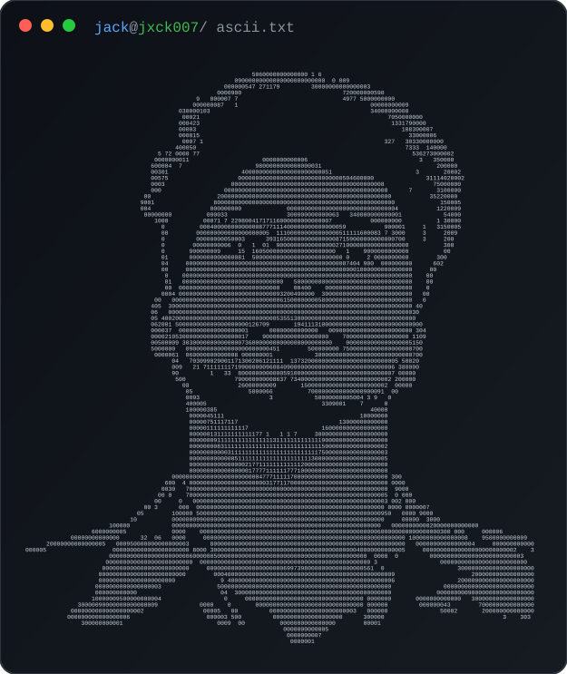

# Jegadeesh Nandakumar

### Software Engineering Student · Product Builder

 

 

---

## About Me

I am **Jegadeesh Nandakumar (Jack)**, a third-year Computer Science and Engineering student at **Rajalakshmi Institute of Technology, Chennai**.

I build practical software for real use cases, including event platforms, billing tools, workflow systems, mobile applications, and student-focused products. I use AI-assisted development to move faster, while still learning the underlying product logic, database design, deployment flow, and failure points.

|  |  |
|:--:|:--|
| 🎓 | B.E. Computer Science and Engineering — 3rd Year |
| 📍 | Chennai, Tamil Nadu, India |
| 💼 | Software Engineering Student · Product Builder |
| 🔭 | Building **UniQScan**, a paperless OD workflow system |
| 🌱 | Learning backend development, Docker, AWS, and CI/CD |
| 🏆 | 2nd Prize — Unlock AI, VIT Chennai Vibrance 2026 |

---

## Featured Projects

### ZYPHORIA'26 — Official Symposium Website

Official symposium platform for event information, registrations, and live event coordination.

- Contributed to a production-style event website with Supabase integration.
- Supported registrations, event information, and symposium operations.
- Worked in a collaborative development workflow.

---

### BillEase — Bilingual Billing Platform

Billing and invoice platform designed for a real family-business workflow with Tamil and English support.

- Built bilingual billing, quotation, and invoice workflows.
- Used Firebase for cloud-backed data handling and synchronization.
- Focused on practical usability for non-technical users.

---

### Mystery Box — Event and Game Management Platform

Live event platform for team flow, scoring, leaderboards, and organizer controls.

- Served as **Assistant Coordinator** for an event with approximately **65 teams**.
- Built and supported team management, scoring, leaderboard, and admin workflows.
- Used Supabase-backed data handling during live event operations.

---

### UniQScan — OD and Permission Management

Mobile-first paperless OD and permission workflow system for students and staff.

- Contributed to a digital replacement for paper-based approval flows.
- Worked with Flutter and Firebase for mobile application development.
- Currently under active academic and collaborative development.

---

### Forge Resume — AI-Assisted Resume Builder

Resume-building product with guided editing, import workflows, live preview, and export support.

- Built resume creation, editing, preview, and export workflows.
- Added optional AI-assisted writing and import features.
- Focused on a transparent, student-friendly resume-building experience.

---

## More Projects

<b>Open project archive</b>

 

| Project | Stack | Description |
|:--|:--|:--|
| QUBE / QR Aura | React · TypeScript | Customizable QR generator with local history and frontend utilities |
| RIT GrubPoint | Flutter · Firebase · Dart | Food ordering application with authentication, cart, wallet, and ordering |
| Flask Resume Builder | Flask · Python · HTML/CSS | Resume-generation web application built while learning Flask |
| Mafia | Kotlin · Firebase · Gemini API | Mobile Mafia game concept under development |
| Edumate | Flutter | Educational chatbot concept for academic and campus queries |
| Predictive Load Balancer | JavaScript · Node · React · PostgreSQL | Academic load-balancing dashboard and simulation |
| Kimera Vel Tech | TypeScript · CSS | Business website for a family-owned technology company |

---

## Tech Stack

### Comfortable and Hands-on

### Project Exposure

### Tools and Deployment

### Currently Learning

---

## Experience

| Period | Role | Organization |
|:--|:--|:--|
| Feb–Mar 2026 | Backend Python Intern | Tamizhan Skills |
| Feb–Mar 2026 | DevOps and Cloud Automation Intern | Tamizhan Skills |
| Jun–Jul 2025 | Python Development Intern | Cognifyz Technologies |
| Jun–Jul 2025 | Python Developer Intern | CodSoft |

---

## Achievements

- **2nd Prize — Unlock AI**, VIT Chennai Vibrance 2026, as part of Team Jack Sparrow.
- **Assistant Coordinator — Mystery Box**, supporting approximately 65 participating teams.
- Contributed to the official **ZYPHORIA'26 Symposium Website**.
- Built **BillEase** for a real business billing workflow.

---

## GitHub Activity

  

  

---

## LeetCode Progress

---

## 2026 Goals

- ✅ Build software used in real business, event, or student workflows.
- ✅ Work on collaborative projects with live users and organizers.
- 🔄 Complete UniQScan and strengthen backend fundamentals.
- 🔄 Learn Docker, AWS, and CI/CD properly.
- ⏳ Contribute meaningfully to open-source projects.
- ⏳ Become internship-ready for software engineering roles.

---

## Contribution Snake

<picture>
  <source media="(prefers-color-scheme: dark)" srcset="https://raw.githubusercontent.com/Jxck007/Jxck007/output/github-snake-dark.svg"/>
  <source media="(prefers-color-scheme: light)" srcset="https://raw.githubusercontent.com/Jxck007/Jxck007/output/github-snake.svg"/>
  
</picture>

---

## Connect

  

Built with curiosity, iteration, and a preference for practical software.

