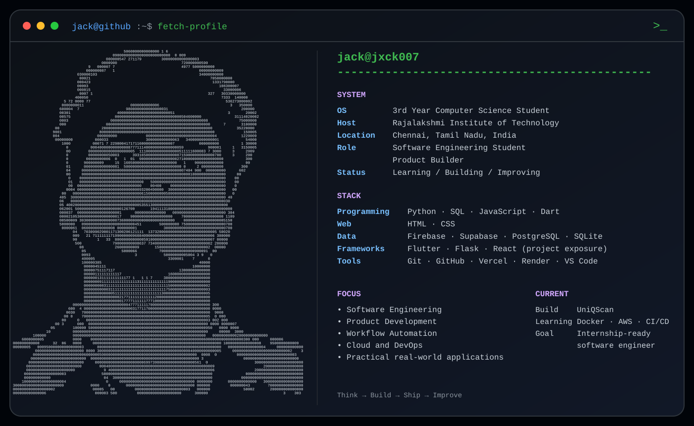

 

---

## 🧑‍💻 About Me

Hi, I'm **Jegadeesh Nandakumar (Jack)**.

I am a **third-year Computer Science and Engineering student** at **Rajalakshmi Institute of Technology, Chennai**. I enjoy building practical software for real use cases—from symposium platforms and billing tools to workflow systems and event-management products.

I use AI-assisted tools to accelerate development and learning, while still focusing on the **workflow, product logic, database structure, deployment process, and failure points** behind what I build.

---

## 🚀 Featured Projects

### 🌐 ZYPHORIA'26 — Official Symposium Website

Official symposium website built for event information, registration, and live coordination.

- Contributed to the official symposium platform.
- Supported registrations, event information, and event operations.
- Worked in a collaborative development environment.

---

### 🧾 BillEase — Bilingual Billing Platform

Billing, quotation, and invoice platform designed for a real family-business workflow.

- Added Tamil and English support.
- Used Firebase for cloud-backed data and synchronization.
- Focused on practical usability for non-technical users.

---

### 🎮 Mystery Box — Event and Game Management Platform

Platform used during a live college event for team handling, scoring, leaderboards, and organizer workflows.

- Served as **Assistant Coordinator** for an event with approximately **65 teams**.
- Built and supported team flow, scoring, leaderboard, and admin features.
- Used Supabase-backed data handling during live event operations.

---

### 📲 UniQScan — OD and Permission Workflow System

Mobile-first paperless OD and permission workflow system for students and staff.

- Replaces paper-based approval flows with a digital process.
- Uses Flutter and Firebase for mobile application development.
- Currently under active academic and collaborative development.

---

### 📄 Forge Resume — AI-Assisted Resume Builder

Resume-building product with import, editing, guided writing, live preview, and export workflows.

- Built resume creation, editing, preview, and export workflows.
- Added optional AI-assisted writing and import tools.
- Focused on a transparent and student-friendly experience.

---

## 🧩 More Projects

<b>Expand project archive</b>

 

| Project | Stack | Description |
|:--|:--|:--|
| **QUBE / QR Aura** | React · TypeScript | Customizable QR generator with local history |
| **RIT GrubPoint** | Flutter · Firebase · Dart | Student food-ordering application |
| **Mafia** | Kotlin · Firebase · Gemini API | Mobile Mafia game under development |
| **Kimera Vel Tech** | TypeScript · CSS | Business website |
| **Edumate** | Flutter | Educational chatbot concept |
| **Predictive Load Balancer** | JavaScript · Node · React · PostgreSQL | Academic full-stack simulation project |

---

## 🛠️ Tech Stack

### Comfortable / Hands-on

### Project Exposure / Learning Through Builds

### Currently Learning

---

## 💼 Experience

| Period | Role | Organization |
|:--|:--|:--|
| Feb–Mar 2026 | Backend Python Intern | Tamizhan Skills |
| Feb–Mar 2026 | DevOps and Cloud Automation Intern | Tamizhan Skills |
| Jun–Jul 2025 | Python Development Intern | Cognifyz Technologies |
| Jun–Jul 2025 | Python Developer Intern | CodSoft |

---

## 🏆 Achievements

- Secured **2nd Prize** in **Unlock AI** at **VIT Chennai Vibrance 2026** as part of **Team Jack Sparrow**.
- Served as **Assistant Coordinator** for the **Mystery Box** event with approximately **65 participating teams**.
- Contributed to the official **ZYPHORIA'26 symposium website**.
- Built **BillEase** for a real business billing workflow.

---

## 📊 GitHub Stats

---

## 🧩 LeetCode Progress

---

## 🐍 Contribution Snake

<picture>
  <source media="(prefers-color-scheme: dark)" srcset="https://raw.githubusercontent.com/Jxck007/Jxck007/output/github-snake-dark.svg"/>
  <source media="(prefers-color-scheme: light)" srcset="https://raw.githubusercontent.com/Jxck007/Jxck007/output/github-snake.svg"/>
  
</picture>

---

## 📬 Connect With Me

  

